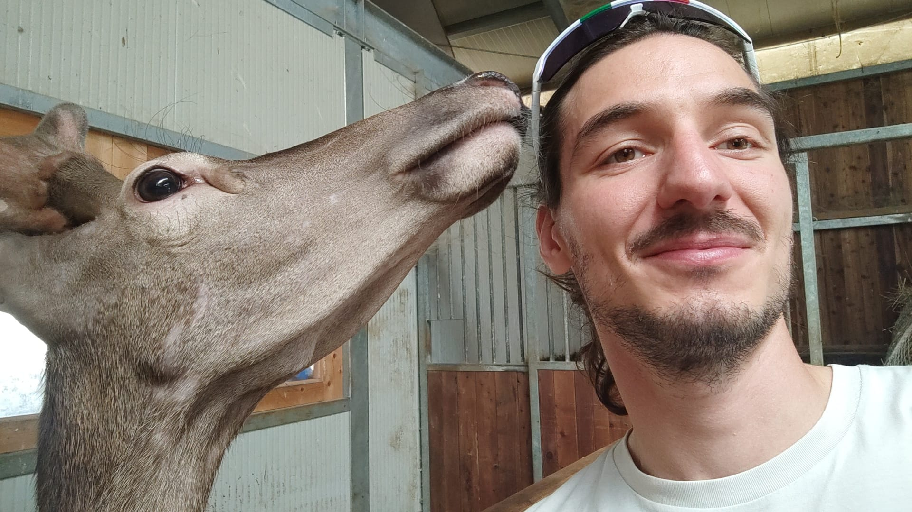

  <!-- Primo blocco: Immagine e Descrizione -->
  

    
    
 Matteo Cinelli, Sapienza University of Rome, matteo.cinelli@uniroma1.it

  

  <!-- Secondo blocco: Immagine e Descrizione -->
  

    
    
 Max Falkenberg, Central European University, max.falkenberg@protonmail.com

  

  <!-- Terzo blocco: Immagine e Descrizione -->
  

    
    
Alessandro Galeazzi, University of Padova, alessandro.galeazzi@unipd.it

  

